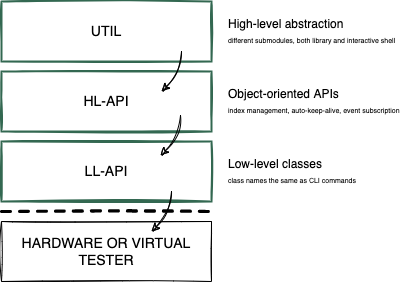

API Structure
==================================

XOA Python API consists of three layers on top of the Xena proprietary binary API, as shown below.

    :term:`High-level Functions (HL-FUNC)<HL-FUNC>` provides high-level abstraction functions

    :term:`High-Level API (HL-API)<HL-API>` provides object-oriented APIs.

    :term:`Low-Level API (LL-API)<LL-API>` provides low-level class.

    XOA Python API Stack View

.. rubric:: Low-Level API

LL-API contains low-level API classes, giving you the direct control of the tester. The names of the classes are the same as the the CLI commands in :term:`XOA CLI`, making it easy for you to understand the Python API if you are already familiar with XOA CLI. However, unlike HL-API, LL-API does not provide functionalities such as *auto connection keep-alive* and *auto index management*. This means you need to write more codes to handle those yourself.

For example, to change the description of a tester using LL-API:

.. code-block:: python
    
    # Directly using class P_RESERVATION. This is only valid when the port is not reserved by others.
    await P_RESERVATION(handler).set(operation=ReservedAction.RESERVE)

.. seealso::

    Read more about :ref:`LL-API <low_level_api_label>`.

.. rubric:: High-Level API

HL-API uses the classes defined in LL-API and lets you quickly develop scripts or program in an **object-oriented** fashion with explicit definition of commands of different *tester*, *module*, *port* types. In addition, the HL-API layer provides functionalities such as:

    * :ref:`Auto connection keep-alive <session_label>`
    * :ref:`Auto index management <resource_managers_label>`
    * :ref:`Resources identification tracking for push notification <event_subscription_label>`

For example, to reserve a port using HL-API:

.. code-block:: python
    
    # Standard way with set(). This is only valid when the port is not reserved by others.
    await port.reservation.set(operation=ReservedAction.RESERVE)

    # or wrapper function set_reserve()
    await port.reservation.port.reservation.set_reserve()

.. seealso::

    Read more about :ref:`HL-API <high_level_api_label>`.

.. rubric:: High-Level Functions

HL-FUNC provides **high-level abstraction** functions on top of the object-oriented APIs in HL-API, aiming to help you simplify code logics and increase readability and maintainability. HL-FUNC consists of sub-libraries where functions are grouped based on functionalities, such as :term:`ANLT<ANLT>`. Complex operation sequences are wrapped inside high-level functions, e.g. initiating link training, reserving ports, etc.

.. code-block:: python
    
    # Regardless of who owns the port, this function makes sure you have the ownership.
    await reserve_port(port)

    # Enable link training on the port, regardless what the sequence of operations should be.
    await lt(port=port, enable=True, timeout_enable=True, mode="interactive")

.. important::

    For test script development, you can 

.. seealso::

    Read more about :ref:`HL-FUNC <hl_func_label>`.