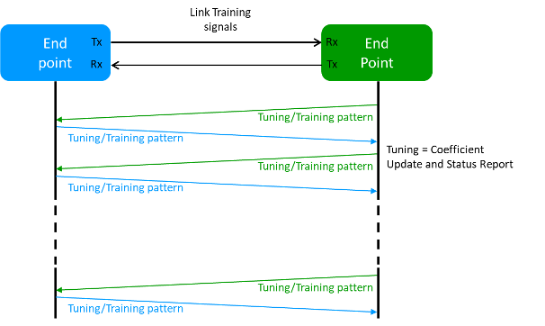

.. _util_label:

Utility
===================================

UTIL provides high-level abstraction functions on top of the object-oriented APIs in HL-API, aiming to help you simplify code logics and increase readability and maintainability. UTIL consists of sub-libraries where functions are grouped based on functionalities, such as :term:`ANLT<ANLT>`. Complex operation sequences are wrapped inside high-level functions, e.g. initiating link training, reserving ports, etc.

UTIL can be used in two different ways:

* Library Mode: you can import the Python library into your test scripts and use the functions.

* Interactive Mode: an interactive shell for you to execute functions in a command-line fashion. This is very helpful when you need a command-line interface for interactive testing. 

ANLT
------------------------------------

**ANLT** (Auto-Negotiation and Link Training) provides functions to help you fine-tune the protocol to its optimal state, test interoperability between different vendors, and protocol compliance for different implementations.

Auto-negotiation (AN) was originally designed for Ethernet over twisted pair up to 1G. Beyond exchanging speed capabilities for the link participants, AN has evolved for today's Ethernet to include additional configuration information for establishing reliable and consistent connections. AN allows the devices at the end points of a link to negotiate common transmission parameters capabilities like speed and duplex mode, exchange extended page information and media signaling support. At higher speeds and signaling the choice of FEC may be relevant. It is during auto negotiation the end points of a link share their capabilities and choose the highest performance transmission mode they both support.

.. figure:: ../_static/autoneg_process.png
   :scale: 70 %
   :align: center

   `Auto-Negotiation Process <https://xenanetworks.com/whitepaper/autoneg-link-training/>`_

Once the ports in the link have completed the requisite AN information exchange and reached agreement, the link partners move to the next step, link training (LT), the exchange of Training Sequences. This is essential to tune the channels for optimal transmission. During link training the two end points of the link will exchange signals.

   `Link Training Process <https://xenanetworks.com/whitepaper/autoneg-link-training/>`_

.. rubric:: No Auto negotiation, No Link Training

In some instances, Auto negotiation and Link Training are not required to establish a communication path: High speed optical transceivers and interfaces typically only run at one speed, so there is no need the negotiate this. Link Training is only required for electrical interfaces - in some cases (e.g. when short cables are used) an electrical interface may become operational just using default settings of the terminal equipment in the communication path. The IEEE 802.3by specification allows for force connect over electrical interfaces in these instances.

.. rubric:: No Auto negotiation, Link Training

While Link Training can be essential to make some electrical interfaces work, Auto negotiation may not be required is the link speed is fixed or if it can be manually set at both end points of a link.

.. rubric:: Auto negotiation and Link Training

Auto negotiation and Link Training are in principle two independent processes. However, when both are done, Auto negotiation must be done first to determine the overall mode for a link and then perform the Link Training. Hereby you get the sequence shown in the figure below.

   `Auto-Negotiation and Link Training Sequence <https://xenanetworks.com/whitepaper/autoneg-link-training/>`_

.. seealso::

   Read more about `Auto Negotiation and Link Training on NRZ and PAM4 based Ethernet Interfaces <https://xenanetworks.com/whitepaper/autoneg-link-training/>`_.

**XOA UTIL ANLT** provides the following functionalities for you to do auto-negotiation and link training tests.

AN Functionalities
^^^^^^^^^^^^^^^^^^^^

1. Enable/disable auto-negotiation
2. Auto-negotiation trace log, provides AN trace log for debugging and troubleshooting.
3. Auto-negotiation status, provides the following AN status:

   * Received and transmitted number of Link Code Words (Base Pages), message pages, and unformatted pages
   * Number of HCD (Highest Common Denominator) failures
   * Number of FEC failures
   * Number of LOS (Loss of Sync) failures
   * Number of timeouts
   * Number of successes
   * Duration of AN in microseconds

LT Functionalities
^^^^^^^^^^^^^^^^^^^^^

1. Enable/disable link training
2. Allow/deny link training loopback
3. Enable/disable link training timeout
4. Tuning link partner TX EQ coefficient, use presets as a starting point to tune link partner TX EQ coefficients per lane, increment and decrement of coefficients c(-3), c(-2), c(-1), c(0), c(1).
5. Configure local TX EQ coefficients
6. Monitor local TX EQ coefficients
7. Link training trace log per lane
8. Link training status per lane, provides the following LT status:

   * Number of lost locks
   * Local value of coefficient (per coefficient)
   * RX number of increment/decrement requests from link partner (per coefficient)
   * RX number of EQ coefficient request limits reached from link partner (per coefficient)
   * RX number of EQ request limits reached from link partner (per coefficient)
   * RX number of coefficients not supported from link partner (per coefficient)
   * RX number of coefficients at limit from link partner (per coefficient)
   * TX number of increment/decrement requests to link partner (per coefficient)
   * TX number of EQ coefficient request limits reached to link partner (per coefficient)
   * TX number of EQ request limits reached to link partner (per coefficient)
   * TX number of coefficients not supported to link partner (per coefficient)
   * TX number of coefficients at limit to link partner (per coefficient)
   * Duration of LT in microseconds
   * PRBS total error bits
   * PRBS total error bits
   * PRBS bit error rate
   * Local frame lock status
   * Link partner frame lock status

Test Resource Management
------------------------------------

As described in :doc:`../test_resource_mgt`, you need to reserve the test resource (chassis/module/port) to do `set` operations. In order to achieve this, you need to first check the ownership of the test resource, and relinquish it in case it is owned by someone else, and then reserve it. Such as sequence of operations can be simplified by the high-level abstraction functions in UTIL.

1. Reserve chassis (in future release)
2. Reserve module (in future release)
3. Reserve port